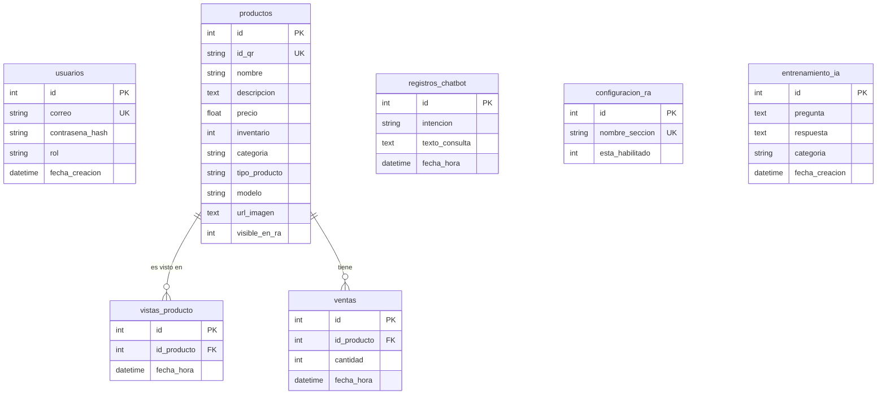

# Modelo Relacional de Datos (LogCoC) - Español

A continuación se muestra una representación visual (Diagrama de Entidad-Relación) del modelo de datos de tu aplicación, traducido conceptualmente al español para facilitar su lectura.

## Ubicación en el Código (Nombres Originales)
Recuerda que en el código de tu proyecto, estas tablas y campos están en inglés. Si deseas inspeccionar o modificar este modelo, puedes encontrarlo en las siguientes ubicaciones de tu proyecto:

- **Esquema SQL Inicial:** backend/database_docs/database.sql
- **Modelos de SQLAlchemy (Python):** Se encuentran en el directorio `backend/models/`:
  - user.py (Tabla `users`)
  - product.py (Tabla `products`)
  - statistics.py (Tablas `product_views`, `sales`, `chatbot_logs`)
  - admin.py (Tablas `ar_settings`, `ai_training`)
